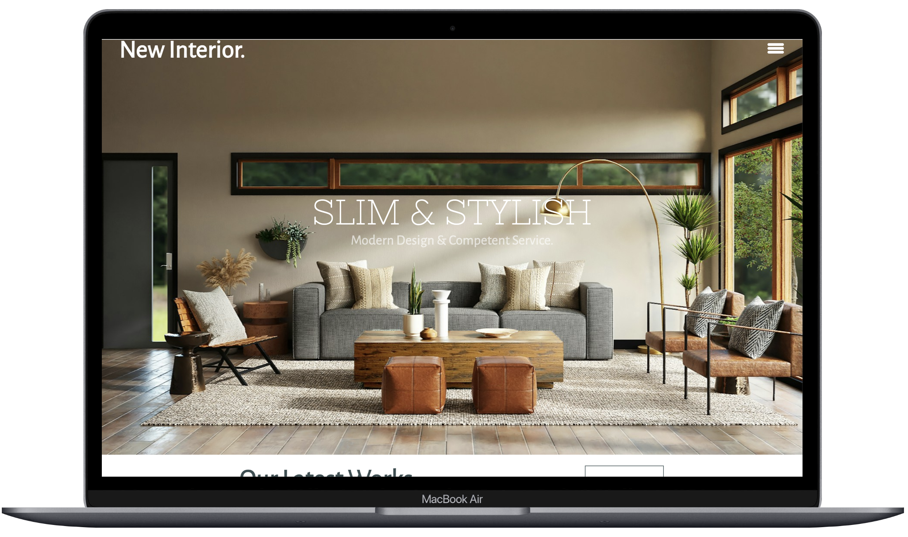
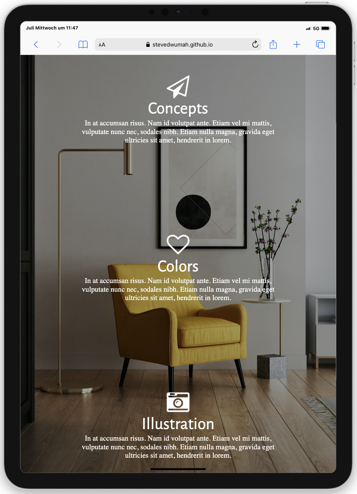
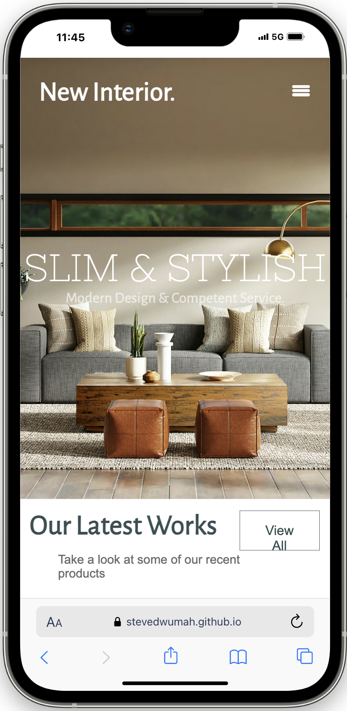

# Project Interior 🛋️

<div style="display: flex; justify-content: center;">
  
</div>


## Table of Contents
1. [About](#general-info)
2. [Techstack](#technologies)
3. [Installation](#installation)
4. [Design](#design)
5. [FAQs](#faqs)

## About

This project is a part of a Fullstack Bootcamp. It was developed over the course of two days. Using Visual Studio Code, I built this project with HTML and CSS for styling.

The aim of this project was to practice the concepts learned in the first module of the Bootcamp, specifically HTML and CSS. The result is a flexible and responsive website that could serve as a rental platform for interior design. It features a Headline and a burger menu adapts to screen size. Additionally, it includes detailed product cards and a generally adaptive layout.


<div style="display: flex; justify-content: space-between; align-items: center; width: 100%">
    
    
</div>

## Techstack


**Markup:**  
  
**Styling:**  
 
  
  **IDE:**  
  
**Version Control:**  
    
**Design:**  


## Installation


Before you begin, ensure you have the following installed:

- [Git](https://git-scm.com/)
- [VS Code](https://code.visualstudio.com/download)
- [Live Server Extention for VS Code](https://marketplace.visualstudio.com/items?itemName=ritwickdey.LiveServer)

1. **Clone the repository:**

```bash
git clone https://git@github.com:SteveDwumah/Projekt_Interior.git
   ```
2. **Open the project and click to Go Live from the status bar to turn the server on.**     

## Design

The design for "Project Interior" was provided as part of the Bootcamp and created using Figma. This design served as a blueprint to guide the development of the project, ensuring a cohesive and visually appealing user experience.

## Deployment

The "Interior" project is deployed using GitHub Pages, making it easily accessible to everyone
The live version of "Project Interior" can be accessed [here:](https://stevedwumah.github.io/Projekt_Interior/)